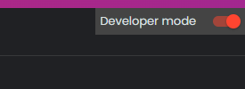
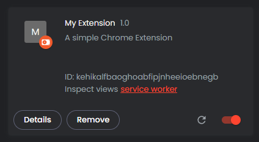

### Step 1: Download the Boilerplate

Download the boilerplate files or clone this repository.
``` 
git clone https://github.com/purnellbp/Chrome-Extension-Boilerplate-Manifest-V3.git
```

### Step 2: Open Chrome Extensions Page

Open Google Chrome and navigate to `chrome://extensions/`. (or a browser based on chromium i.e. - [Brave Browser](https://brave.com/))

### Step 3: Enable Developer Mode

Toggle the 'Developer mode' switch at the top-right corner of the Extensions page.


### Step 4: Load the Extension

Click the 'Load unpacked' button and select the folder where you extracted the boilerplate files.

### Step 5: Test the Popup

Click the extension icon in the Chrome toolbar to open the popup. You should see a message saying 'Hello, this is a popup!'.

### Step 6: Test the Thank You Page

Since the extension is already installed, you won't see the 'Thank You' page automatically. To test it, reload the extension from the Extensions page.

### Step 7: Test the Settings Page

Right-click the extension icon and select 'Options' to open the Settings page. You should see a link to the Twitter account.

### Step 8: Make Modifications

Feel free to modify the HTML, CSS, and JavaScript files to add more features or change the existing ones.

### Step 9: Reload After Changes

After making any changes, make sure to reload the extension from the Extensions page to see the updates.

### Step 10: Publish

Once you're satisfied with your extension, you can publish it to the Chrome Web Store.

## Conclusion

You've successfully set up and tested a Chrome Extension using the provided boilerplate. You're now ready to add more features and publish your extension.